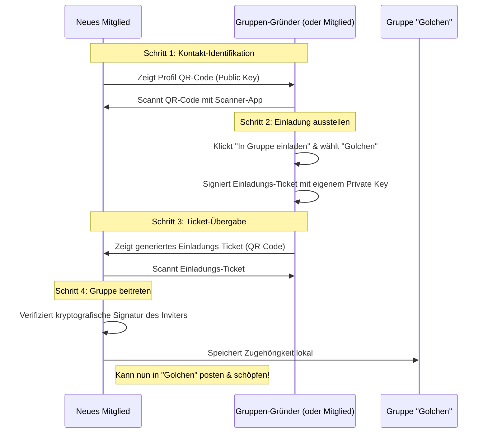
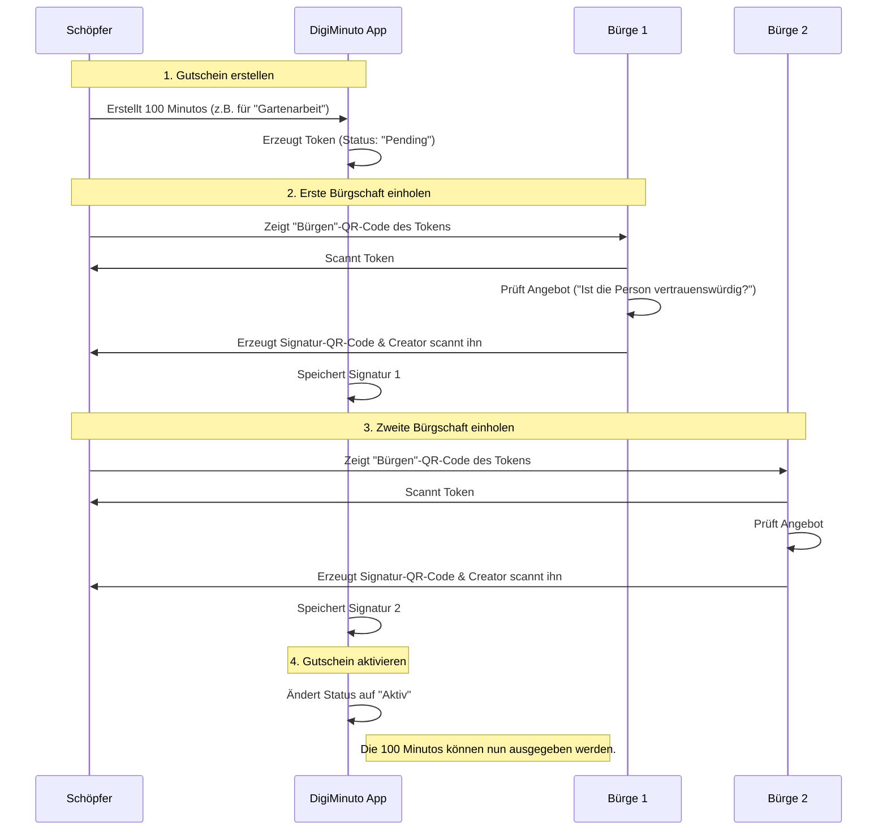
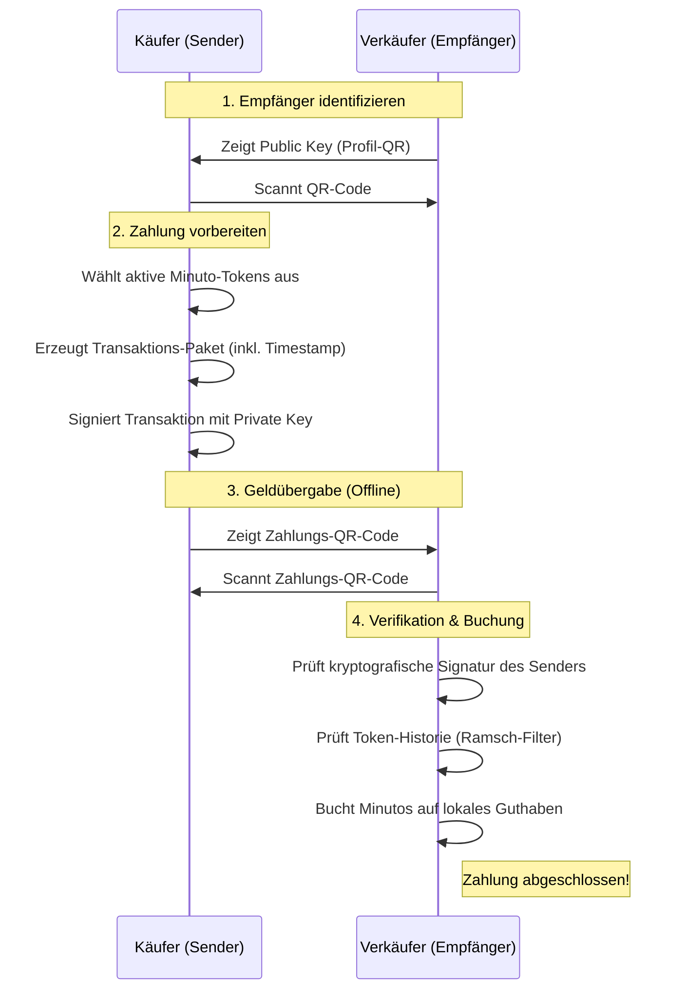

# DigiMinuto: Prozess-Visualisierungen

In diesem Dokument findest du die wichtigsten Abläufe innerhalb der DigiMinuto-App grafisch als Sequenz- und Flussdiagramme dargestellt. Diese eignen sich hervorragend für Präsentationen oder das Architektur-Verständnis im Team.

---

## 1. Gruppeneinladung (Community Onboarding)

Da DigiMinuto auf dezentralen, isolierten Gruppen ("Communities" wie z.B. das Ökodorf *Golchen*) basiert, muss jeder Nutzer kryptografisch eingeladen werden. Dies verhindert globalen Spam.



---

## 2. Minuto schöpfen & Bürgen (Web of Trust)

Geld wird bei DigiMinuto nicht durch Mining oder Banken geschöpft, sondern durch die Nutzer selbst – abgesichert durch das Vertrauen von zwei Bürgen.



---

## 3. Bezahlvorgang / Transfer (Offline & P2P)

Der Austausch von Minutos findet direkt zwischen zwei Personen statt. Eine zentrale Bank zur Verifikation gibt es nicht.



---

## 4. Marktplatz & Synchronisation (Nostr Netzwerk)

Um Angebote und Gesuche gruppenweit (nicht nur von Angesicht zu Angesicht) zu verteilen, nutzt DigiMinuto das dezentrale Nostr-Protokoll.

```mermaid
flowchart TD
    A[Alice (Gruppe 'Golchen')] -->|Erstellt Gesuch| B(Lokale App)
    B -->|Hängt Einladungs-Ticket an| C{Nostr Relays (Cloud)}
    C -->|Broadcast an Abonnenten| D(Lokale App von Bob)
    
    D --> E{Prüfe Ticket}
    E -->|Ungültig / Falsche Gruppe| F[Verwerfen (Spam-Schutz)]
    E -->|Gültig & Gruppe 'Golchen'| G[Zeige auf Pinnwand an]
    
    style C fill:#f9f,stroke:#333,stroke-width:2px
```
